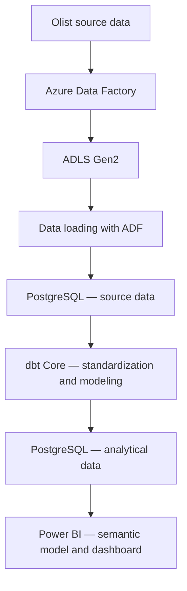

# Cloud Analyst — Olist E-commerce Analytics Platform

> An e-commerce analytics platform combining Azure Data Factory, PostgreSQL, dbt Core, and Power BI to explore sales performance, customer behavior, and seller contribution.

## 1. Project Overview

**Cloud Analyst** transforms Olist Brazilian e-commerce transaction data into analytical data models and a Power BI dashboard, supporting business analysis across time, geography, customers, products, and sellers.

The project focuses on:

- Monitoring revenue and purchasing activity over time.
- Segmenting customers with RFM to evaluate customer behavior and value.
- Analyzing customer value across geographic areas.
- Identifying product categories with high sales contribution.
- Evaluating seller contribution and customer review scores.

The workflow follows a business-driven approach:

**Business Problem → Business Questions → Business Requirements → Metric Dictionary → Data Requirements → Analytical Models → Dashboard**

The source data includes orders, order items, payments, customers, products, sellers, and reviews. These sources are standardized and aggregated at appropriate levels of detail before being used in reporting.

## 2. Business Questions

- **BQ1 — Customer Segmentation:** Which customer segments should be prioritized for marketing and customer engagement based on purchasing behavior and business value?

- **BQ2 — Customer Value by Geography:** Which customer segments generate the highest business value across different geographic areas?

- **BQ3 — Product Performance by Geography:** Which product categories and products contribute the most to sales performance across different geographic areas?

- **BQ4 — Seller Performance:** Which sellers have the greatest impact on sales performance and customer satisfaction, and which sellers require performance improvement?

- **BQ5 — Sales Performance Over Time:** How does sales performance change across different time periods, and which periods contribute most to business revenue?

- **BQ7 — Geographic Performance:** Which geographic areas have the highest sales activity and customer concentration?

- **BQ8 — Customer Satisfaction:** How does customer satisfaction vary across product categories and sellers?

Detailed analytical scope and requirements are available in [`documents/business-understanding`](documents/business-understanding/).

## 3. Dashboard Overview

The dashboard contains three pages, covering business performance at an overview level and more detailed analysis of customers, product categories, and sellers.

### 3.1. Executive Overview

**Purpose:** Monitor the scale of business activity, changes over time, and the contribution of geographic areas.

The page summarizes revenue, orders, and customers, combining time trends with a ranking of customer states by revenue.

The analysis covers:

- Revenue and order trends by year, quarter, and month.
- Changes in revenue and orders compared with the same period in the previous year.
- Customer states with the highest revenue contribution.
- Order value and repeat purchasing within the selected scope.

YoY figures should be interpreted by checking the date ranges of both periods. For example, revenue from January through September 2018 should be compared with January through September 2017, rather than the whole of 2017. The dataset does not cover every year in full, so comparability depends on the selected period.

**Business questions supported:** BQ5, BQ7.

### 3.2. Customer Analytics

**Purpose:** Evaluate purchasing behavior, value, and geographic distribution across customer segments.

The page uses a **30 August 2018 snapshot** with a **rolling 12-month analysis window**.

| KPI | Meaning |
|---|---|
| **VIP Customers** | Number of customers in the VIP segment at the snapshot |
| **VIP Monetary** | Total monetary value of VIP customers within the analysis window |
| **Avg Monetary** | Average monetary value per customer |
| **Avg Frequency** | Average number of orders per customer |
| **Avg Recency** | Average number of days between the latest purchase and the snapshot date |

The analysis covers:

- Comparing total monetary value across customer segments.
- Evaluating each segment through customer count, monetary share, average spending, purchasing frequency, and recency.
- Identifying the **10 states with the highest total customer monetary value** and examining each segment's contribution within those states.
- Exploring customer characteristics by state and segment, including customer count, average spending, average orders, and latest purchase date.

Customer value is attributed to the selected location at the snapshot; it is not an allocation of revenue to the location of each historical transaction.

**Business questions supported:** BQ1, BQ2.

### 3.3. Seller & Product Analytics

**Purpose:** Evaluate sales contribution from product categories and sellers, alongside review scores, to identify areas for further investigation.

| KPI | Meaning |
|---|---|
| **Sales** | Total item sales value from delivered orders within the analytical scope |
| **Items Sold** | Total number of items sold through delivered orders |
| **Active Sellers** | Number of sellers with delivered orders in the selected period |
| **Average Review Score** | Average review score weighted by the number of reviewed orders |
| **Low-rated Seller Rate** | Proportion of reviewed sellers whose average review score is at most 2 |

The analysis covers:

- Ranking the **10 product categories with the highest sales**.
- Examining each category's leading customer state by sales, average review score, delivered order count, and items sold.
- Comparing sales and review scores across sellers, with delivered order count representing the scale of seller activity.
- Identifying sellers with average review scores of at most 2 and examining their sales contribution.
- Exploring individual sellers through their identifier, state, sales, review score, order count, and items sold.

Review scores reflect the order experience associated with products or sellers; they do not directly establish the cause of customer satisfaction or dissatisfaction.

**Business questions supported:** BQ3, BQ4, BQ8.

The report project and semantic model are available in [`analytics/powerbi`](analytics/powerbi/).

## 4. Architecture & Technology Stack

The project separates responsibilities for ingestion, storage, data transformation, and analysis.



| Technology | Role in the project |
|---|---|
| **Azure Data Factory** | Ingest data and orchestrate loading workflows |
| **Azure Data Lake Storage Gen2** | Store data files in the cloud |
| **PostgreSQL** | Store source data and analytical tables |
| **dbt Core** | Standardize and transform data, organize business logic, and run data tests |
| **Power BI** | Build the semantic model, calculate context-dependent measures, and visualize data |
| **Python / Pandas** | Profile data quality and perform exploratory analysis |
| **Git / GitHub** | Version source code, documentation, and report definitions |

dbt models execute in PostgreSQL. Power BI consumes analytical data from the warehouse to produce business reports.

## 5. Role of dbt in the Project

Olist data is distributed across multiple tables with different levels of detail. An order can contain multiple items, have multiple payment records, or involve multiple sellers. Incorrect joins and aggregations can therefore duplicate metric values.

**dbt organizes SQL transformations into a system of reusable, testable models with explicit dependencies.**

### 5.1. Standardizing Source Data

The **staging** layer standardizes column names and data types and handles source-data cases according to defined rules, providing consistent inputs for downstream models.

### 5.2. Centralizing and Reusing Business Logic

The **intermediate** layer organizes shared transformations, including:

- Linking orders to customer identities.
- Aggregating payments at the order level.
- Preparing data for RFM calculations.
- Processing data before aggregation into product and seller metrics.

This structure reduces duplication of the same logic across tables and reports.

### 5.3. Building Analytical Datasets

The **marts** layer provides facts, dimensions, and metric tables for Power BI.

Its main outputs support:

- Revenue at the order level.
- RFM at the customer and snapshot level.
- Product sales by date and customer state.
- Seller performance by date.
- Unique customer identity and customer location at each snapshot.

Each model specifies what one row represents, helping determine the appropriate aggregation method for analysis.

### 5.4. Managing Dependencies and Testing

dbt declares model dependencies through `ref()`, supporting execution in dependency order and data tests alongside the models.

Within the project:

- **dbt** handles standardization and shared transformation logic.
- **DAX** handles filter-context calculations, time comparisons, and aggregations that require report-level processing.

Source code is available in [`dbt/cloud_analyst`](dbt/cloud_analyst/).

## 6. Data Quality & Validation

Data is checked at both the model and reporting layers.

| Validation area | Purpose |
|---|---|
| **Required fields** | Check that keys and required attributes are not missing |
| **Uniqueness** | Validate individual or composite keys against the table's grain |
| **References between tables** | Check that referenced keys exist in the related model |
| **Valid value domains** | Validate segment labels, review scores, and bounded values |
| **Business consistency** | Check relationships between metrics, such as reviewed orders not exceeding total orders |
| **Report reconciliation** | Compare selected Power BI metrics with SQL aggregates |

Validation combines automated tests with checks of filter context and aggregation behavior. Passing tests confirms the conditions tested; it does not replace the assessment of business definitions.

## 7. Repository Structure

```text
CLoud-Analyst/
├── Data/                         # Source data
├── Notebook/
│   └── analysis/                 # Data profiling and exploratory analysis
├── pipelines/                    # Pipeline configuration and documentation
├── dbt/
│   └── cloud_analyst/
│       ├── models/
│       │   ├── staging/          # Source data standardization
│       │   ├── intermediate/     # Shared transformation logic
│       │   └── marts/            # Facts, dimensions, and metrics
│       ├── macros/               # Shared SQL/Jinja macros
│       ├── tests/                # Additional data tests
│       ├── dbt_project.yml       # dbt project configuration
│       └── packages.yml          # Package declarations
├── analytics/
│   └── powerbi/                  # Power BI report and semantic model
├── documents/
│   ├── business-understanding/   # Business problem, requirements, and metrics
│   └── modeling/                 # Data model documentation
└── README.md                     # Project overview
```
