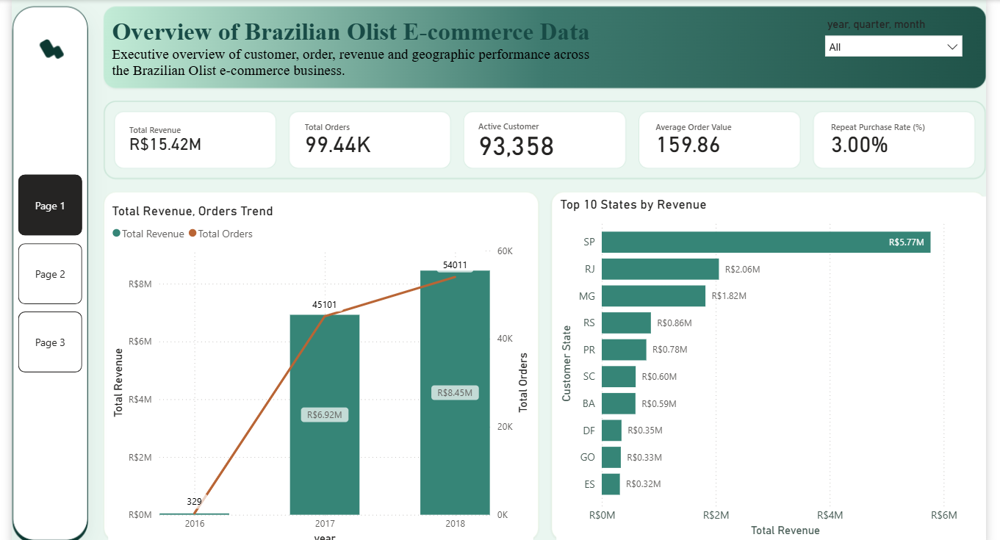
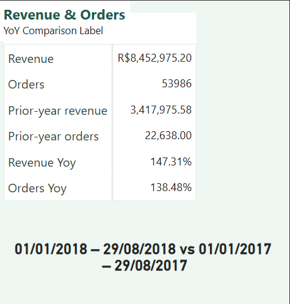
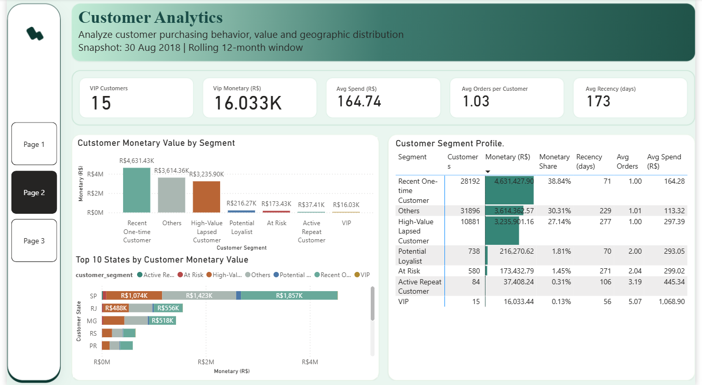
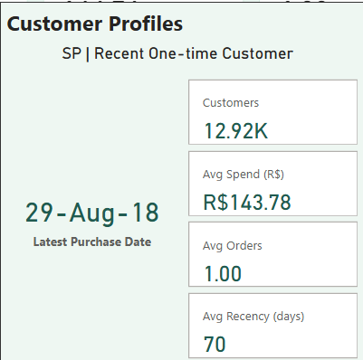
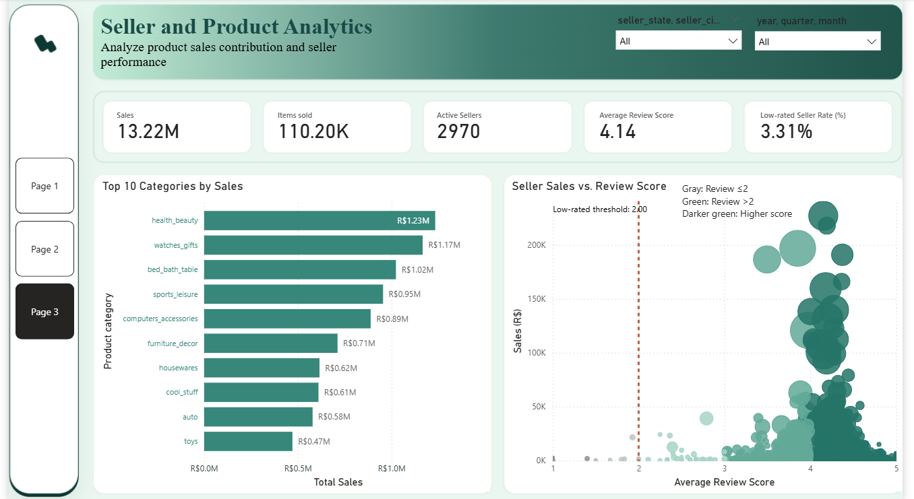
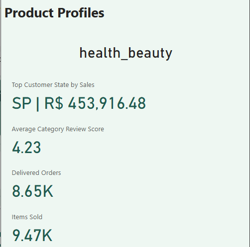
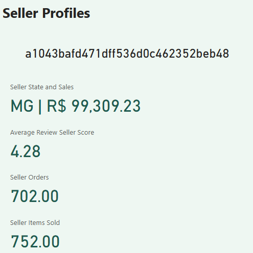

# Olist — Business Performance Analysis

This document presents findings from the Olist dashboard, quantitative evidence, and business implications. The analysis covers three perspectives: overall business performance, customer value, and contributions from product categories and sellers.

## 1. Analytical Objectives and Scope

The analysis focuses on the following questions:

- How are revenue and order activity distributed over time and across geographic areas?
- Which customer segments contribute substantial value and warrant targeted engagement?
- Which product categories and sellers contribute the most to sales?
- How can review scores help identify areas that require further investigation?

| Perspective | Scope |
|---|---|
| **Executive Overview** | The full available dataset period, 2016–2018; year-over-year growth compares 1 January–29 August 2018 with 1 January–29 August 2017 |
| **Customer Analytics** | A 30 August 2018 snapshot with a rolling 12-month window; customers must have at least one order with delivered status within the window |
| **Seller & Product Analytics** | Orders with delivered status across the full available dataset period, 2016–2018 |

The three monetary measures have different definitions:

| Measure | Definition |
|---|---|
| **Revenue** | Total payment value for delivered orders with payment data |
| **Sales** | Total item prices in delivered orders, excluding freight |
| **Customer Monetary** | Total payment value for each customer within the RFM window |

Monetary values are expressed in **Brazilian reais — R$**. Revenue and Sales are not measures of profit.

## 2. Executive Overview

This page examines revenue, order activity, and contributions from customer states across the available **2016–2018** data, addressing **BQ5 — business performance over time** and **BQ7 — the geographic distribution of business activity**.



### 2.1. Revenue Contributions over Time and by Geography

| Finding | Evidence | Business implication |
|---|---|---|
| São Paulo contributes the most revenue | SP contributes approximately **R$5.77 million**, or **37.4%** of total revenue, followed by RJ at approximately **R$2.06 million** and MG at approximately **R$1.82 million** | Revenue is substantially concentrated in SP. Changes in business activity in this state could materially affect overall results |
| Recorded revenue in 2018 exceeds that of 2017 | Approximately **R$8.45 million** was recorded in 2018, compared with **R$6.92 million** in 2017 | The available portion of 2018 already records more revenue than 2017. However, the years have different data coverage, so matching date ranges are needed to determine year-over-year growth |

*SP's revenue share is an approximation calculated from rounded dashboard values.*

### 2.2. Year-over-Year Growth in 2018

Using **2018 as the analysis year** and **2017 as the comparison year**, the analysis compares **1 January–29 August 2018** with **1 January–29 August 2017**. Both periods therefore run from the beginning of the year to the same calendar end date.



| Measure | 1 January–29 August 2017 | 1 January–29 August 2018 | Change |
|---|---:|---:|---:|
| Revenue | R$3,417,975.58 | R$8,452,975.20 | **+147.31%** |
| Orders | 22,638 | 53,986 | **+138.48%** |

Compared with the same period in 2017, revenue increased by approximately **R$5.03 million**, while order count increased by **31,348**. Both measures show a substantial expansion in the scale of business activity during the analysis period.

The **53,986 orders** belong to the date range used for the YoY calculation; the **54,011 orders** in the overview chart represent all available order data for 2018.

**Revenue growing faster than order count does not, by itself, mean that average order value increased.** Revenue includes only delivered orders with payment data, whereas Orders counts orders across all statuses.

The **Average Order Value (AOV)** card uses the following calculation:

> **AOV = Total revenue ÷ Number of delivered orders with payment data.**

Therefore, AOV must be compared directly between the two matching periods to determine whether average order value increased or decreased.

### 2.3. Analytical Results and Business Implications

The analysis highlights two findings: **SP contributes approximately 37.4% of revenue across 2016–2018**, and **both revenue and order count grew substantially during 1 January–29 August 2018** compared with the same period a year earlier.

The next analytical step is to compare growth by state and product category to identify the groups contributing most to the overall increase. SP warrants monitoring across periods because of its substantial revenue share. These findings help identify markets and categories for closer examination before allocating resources.

The figures do not establish the causes of growth or demonstrate that SP has the greatest expansion potential. High revenue also does not necessarily imply high profit.

## 3. Customer Analytics

Following the revenue and geographic overview, Customer Analytics examines **which customer segments contribute value and how they purchase**, addressing **BQ1 — customer segment prioritization** and **BQ2 — customer value by geography**.

The analysis uses a **30 August 2018** snapshot and a **rolling 12-month window**, covering **72,386 customers** with at least one order with delivered status within the window. Total Customer Monetary is **R$11,924,836.72**.



### 3.1. Customer Value and Purchasing Behavior

| Measure | Value | Meaning |
|---|---:|---|
| Avg Monetary | R$164.74 | Average payment value per customer within the analysis window |
| Avg Frequency | 1.03 orders/customer | Average number of orders per customer within the analysis window |
| Avg Recency | 173.49 days | Average number of days between the latest purchase and the snapshot |
| VIP Customers | 15 | Number of customers meeting the VIP segmentation rules |
| VIP Monetary | R$16,033.44 | Total payment value of VIP customers within the analysis window |

An average Frequency of **1.03** indicates that purchasing within the window is dominated by customers with one order. However, this is not a repeat purchase rate; return purchasing requires further examination by customer segment.

### 3.2. Segments to Prioritize

| Finding | Evidence | Business implication |
|---|---|---|
| Recent One-time Customer contributes the most Monetary | **28,192 customers**, **R$4,631,427.90** in Monetary, representing **38.84%** of total Monetary; each customer has one order within the window | This segment's size and contribution make it relevant for investigating conversion to a second purchase |
| High-Value Lapsed Customer contributes disproportionately to its customer share | **10,881 customers**, representing **15.03% of customers** but **27.14% of Monetary**; average Recency is approximately **277 days** | These customers have not purchased recently but have substantial recorded purchase value, making them candidates for a re-engagement experiment |
| VIP customers have high average value but a small overall contribution | **15 customers**, average Monetary of approximately **R$1,068.90**, and approximately **0.13%** of total Monetary | Individual attention may be appropriate, but the segment's current size does not justify making VIP customers the sole focus of the customer strategy |

Segment names describe behavior under the project's RFM rules. **Recent One-time Customer does not necessarily mean a first-time customer across the entire purchase history**, and **High-Value Lapsed Customer does not establish that a customer has churned**.

### 3.3. Geographic Distribution of Customer Value

The **Top 10 States by Customer Monetary Value** chart shows that **SP ranks first in total Customer Monetary**. Within SP, **Recent One-time Customer** is the segment with the highest Monetary contribution, at approximately **R$1.86 million**.



| Measure for the segment in SP | Displayed value |
|---|---:|
| Customers | Approximately 12.92 thousand |
| Avg Monetary | R$143.78 |
| Avg Frequency | 1.00 order/customer |
| Avg Recency | 70 days |
| Latest Purchase Date | 29 August 2018 |

This segment contributes substantial Monetary through its large customer base, even though its average Monetary of **R$143.78** is below the **R$164.28** average for the same segment across all states. This distinction separates **a group with high total value** from **a group with high average value per customer**.

With approximately **12.92 thousand customers**, each with one order within the analysis window, **SP × Recent One-time Customer** is a specific group to consider for a post-purchase engagement experiment intended to encourage the next purchase. Its likelihood of generating new orders still needs to be tested.

**29 August 2018** is the most recent purchase date among customers in the group, not the latest purchase date of every customer. Average Recency of **70 days** describes the group's average time since the latest purchase at the snapshot.

Each customer is assigned one representative location from their latest eligible purchase at the snapshot. The chart therefore shows **where customer value is concentrated**, rather than allocating each historical transaction to its delivery location.

### 3.4. Analytical Results and Business Implications

Two segments warrant further attention: **Recent One-time Customer**, to investigate the potential for a second purchase, and **High-Value Lapsed Customer**, for a re-engagement experiment. VIP customers can receive individual attention with resources proportionate to the segment's size.

The geographic view helps identify states with substantial customer counts and Monetary within the target segments. Prioritization should combine segment size, purchasing behavior, and outreach costs, rather than relying only on segment labels.

After identifying **which customer groups warrant attention**, the next section examines **how product categories and sellers contribute**, adding a perspective on sales activity and the order experience.

## 4. Seller & Product Analytics

Seller & Product Analytics examines sales contributions and review scores for product categories and sellers, addressing **BQ3 — product performance by geography**, **BQ4 — seller performance**, and **BQ8 — differences in review scores**.

The results below use orders with **delivered status across the full available 2016–2018 dataset**. This scope differs from the Customer Analytics RFM window, so Sales and Customer Monetary should not be compared directly.



### 4.1. Scale of Activity and Review Scores

| Measure | Displayed value | Meaning |
|---|---:|---|
| Sales | Approximately R$13.22 million | Total item prices in delivered orders, excluding freight |
| Items Sold | Approximately 110.20 thousand | Number of items sold through delivered orders |
| Active Sellers | 2,970 | Number of sellers with delivered orders |
| Average Review Score | 4.14/5 | Average score across reviewed seller–order associations, aggregated using reviewed-order counts as weights |
| Low-rated Seller Rate | 3.31% | Share of sellers with an average score ≤2 among sellers with reviews |

The **4.14/5** average describes the aggregate result but does not fully represent differences between sellers. The **3.31%** rate adds a view of the low-scoring group that warrants separate examination.

### 4.2. Product Category Contributions

| Finding | Evidence | Business implication |
|---|---|---|
| `health_beauty` leads category Sales | Approximately **R$1.23 million**, followed by `watches_gifts` at approximately **R$1.17 million** and `bed_bath_table` at approximately **R$1.02 million** | These are major contributing categories for further investigation of demand and fulfillment capacity |
| SP contributes the most Sales to `health_beauty` | Category Sales in SP total **R$453,916.48** | SP is an important market for this category's sales |
| `health_beauty` has an average review score of 4.23/5 | The score is calculated across distinct delivered orders with reviews that contain products from the category | This adds a view of the order experience alongside sales |



Sales rankings show contribution to sales value, **not rankings by profit**. Decisions to increase investment require additional information about costs, margins, and the capacity to meet demand.

### 4.3. Seller Contributions and Review Scores

The **Seller Sales vs. Review Score** chart combines three measures for each seller:

- **Sales:** contribution to sales value.
- **Average Review Score:** the seller's average review score.
- **Bubble size:** the seller's order count.

The **2/5** threshold identifies the low-scoring group, representing **3.31% of sellers with reviews**. Selecting sellers for support requires examining associated sales, the number of reviewed orders, and review content together. A low score based on very few reviews is not sufficient to establish consistently poor performance.



Reviews reflect the experience of orders associated with a seller; they do not isolate the responsibility of the seller, carrier, or product.

### 4.4. Analytical Results and Business Implications

`health_beauty`, `watches_gifts`, and `bed_bath_table` lead category Sales within the analysis scope. Meanwhile, sellers with average scores of at most 2 warrant investigation of feedback and the scale of the associated impact to identify appropriate support.

Together with Customer Analytics, the dashboard provides two complementary perspectives: **customer groups that warrant attention** and **categories and sellers to monitor for their contributions and order experience**.

A next analytical step could link orders from target customer groups to categories and sellers within the same date range, helping identify relevant engagement content or issues to investigate. Currently, the two pages **do not establish which categories the lapsed customer group purchased, or whether a lack of repeat purchases is associated with low-rated sellers**.

## 5. Actions Suggested by the Analysis

The findings suggest three areas for further work: encouraging repeat purchasing, investigating the order experience associated with low-rated sellers, and identifying sources of growth by market and category.

### 5.1. Encourage Repeat Purchasing by Customer Segment

Recent One-time Customer contributes **38.84% of Customer Monetary**, while High-Value Lapsed Customer contributes **27.14%**. Both groups have substantial value but require different approaches.

| Customer segment | Proposed action | Evaluation approach |
|---|---|---|
| **Recent One-time Customer** | Test post-purchase engagement and relevant product recommendations to encourage the next purchase | Compare the proportion making a subsequent purchase over the same follow-up period between the contacted group and a control group |
| **High-Value Lapsed Customer** | Test re-engagement with a small group; investigate current needs and reasons for the purchase gap before expanding the program | Track return purchase rate, incremental purchase value, and outreach costs against a control group |
| **VIP** | Consider personalized attention with resources proportionate to the 15-customer group | Track subsequent purchasing and individual feedback; avoid generalizing effectiveness from such a small group |

Past purchase value provides a basis for selecting an experimental audience; it does not guarantee a positive response or profitable engagement.

### 5.2. Investigate the Order Experience Associated with Low-Rated Sellers

Sellers with an average score of **at most 2/5** account for **3.31% of sellers with reviews**. This is a starting list for investigation, not grounds for automatically restricting sellers' activity.

For each seller, examine review volume and content, associated sales, delivery performance, and recurring reported issues. Prioritize cases with repeated evidence of poor experiences affecting substantial numbers of orders.

After identifying an issue and providing support, track review scores, the proportion of low ratings, and relevant operational measures over a consistent period. Before-and-after changes should be assessed alongside changes in order volume and customer mix.

### 5.3. Identify Sources of Growth before Allocating More Resources

SP contributes approximately **37.4% of revenue across 2016–2018**. Meanwhile, `health_beauty`, `watches_gifts`, and `bed_bath_table` lead category Sales. These findings identify markets and categories for deeper analysis.

Break down the **147.31%** revenue growth for **1 January–29 August 2018** by state, and separately analyze Sales growth by category over the same two comparison periods. The objective is to identify where growth originates and whether it is concentrated in particular markets or categories.

Before recommending larger budgets or an expanded assortment, add information about costs, margins, and order fulfillment capacity. **High revenue and strong growth identify areas to examine, but are not sufficient on their own to justify investment.**

These actions are proposals based on historical data. Their effectiveness requires additional evidence or experimentation; the project has not measured the impact of implementing these proposals.

**Supporting Documentation and Source Code**

- [Business Questions](../documents/business-understanding/Business_question.md)
- [Business and Metric Documentation](../documents/business-understanding/)
- [dbt Models](../dbt/cloud_analyst/models/)
- [DAX Definitions](powerbi/Olist%20E-commerse%20dashboard.SemanticModel/definition/tables/All%20Measure.tmdl)
- [Power BI Report and Semantic Model](powerbi/)

## 6. Analytics Directory Structure

```text
analytics/
├── README.md
├── images/
│   ├── executive-overview.png
│   ├── executive-yoy-2018.png
│   ├── customer-analytics.png
│   ├── customer-profile-sp-recent-one-time.png
│   ├── seller-product-analytics.png
│   ├── product-profile-health-beauty.png
│   └── seller-profile-mg.png
└── powerbi/
    ├── Olist E-commerse dashboard.pbip
    ├── Olist E-commerse dashboard.Report/
    └── Olist E-commerse dashboard.SemanticModel/
```
