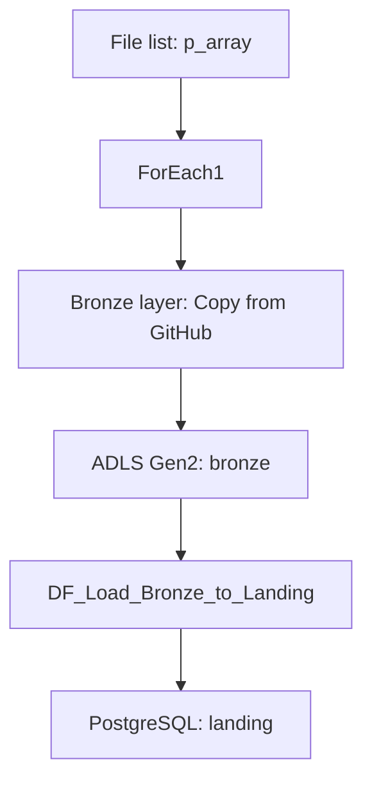

# Azure Data Factory — Olist Data Ingestion Pipeline

## 1. Overview

This directory contains Azure Data Factory configurations for ingesting Olist CSV files from GitHub into **Azure Data Lake Storage Gen2**, then loading them into the **`landing` schema in PostgreSQL**.

The main pipeline, `olist_pipelines`, uses a parameterized file list to process multiple data sources through the same workflow.

Business-level standardization, analytical modeling, and metric calculations are implemented separately in **dbt Core**.

## 2. Pipeline Workflow



| Step | Component | Responsibility |
|---|---|---|
| **1** | `p_array` | Defines the file name and destination folder for each source |
| **2** | `ForEach1` | Iterates over the entries in the list |
| **3** | `Bronze layer` | Reads CSV files from GitHub over HTTP and writes them to ADLS Gen2 |
| **4** | `DF_Load_Bronze_to_Landing` | Reads Bronze data and loads it into the corresponding PostgreSQL table |

The Data Flow runs only after the `Bronze layer` activity succeeds for the corresponding entry.

The pipeline uses a predefined file list; it does not use Get Metadata to discover files dynamically.

## 3. Data Sources and Parameters

### Data Source

The `source_git` dataset reads CSV files over HTTP. Its source path currently references:

```text
Nobita534/CLoud-Analyst/refs/heads/feature/phase2-cloud-ETL-refactoring/Data/raw/
```

This source points to the `feature/phase2-cloud-ETL-refactoring` branch rather than `main`.

Downloading the dataset from Kaggle is outside the pipeline defined in this directory.

### Input File List

Each entry in the `p_array` parameter contains two attributes:

| Attribute | Purpose |
|---|---|
| `file_name` | Name of the CSV file to read |
| `folder_name` | Folder used to store the file in the Bronze layer |

The default list contains **nine files**:

- `olist_customers_dataset.csv`
- `olist_geolocation_dataset.csv`
- `olist_order_items_dataset.csv`
- `olist_order_reviews_dataset.csv`
- `olist_orders_dataset.csv`
- `olist_products_dataset.csv`
- `olist_sellers_dataset.csv`
- `olist_order_payments_dataset.csv`
- `product_category_name_translation.csv`

Example entry:

```json
{
  "folder_name": "olist_customers_dataset",
  "file_name": "olist_customers_dataset.csv"
}
```

## 4. Data Storage and Loading

### ADLS Gen2 — Bronze

The `datawarehouse` dataset uses:

- File system: `bronze`.
- Folder: supplied through `folder_name`.
- File name: supplied through `file_name`.
- Comma-delimited data with the first row used as column headers.

The `Bronze layer` activity uses Copy Activity to read and write tabular data. It is not configured as a binary copy that preserves every byte of the source file.

### PostgreSQL — Landing

The `AzurePostgreSqlTable1` dataset specifies:

- Target schema: `landing`.
- Table name: the file name with the `.csv` extension removed.

Example:

```text
olist_customers_dataset.csv
→ landing.olist_customers_dataset
```

The Data Flow uses the following sink configuration:

| Setting | Value | Meaning |
|---|---|---|
| `truncate` | `true` | Removes existing data from the target table before loading |
| `insertable` | `true` | Allows rows to be inserted |
| `updateable` | `false` | Does not update existing rows individually |
| `upsertable` | `false` | Does not perform upserts |

This configuration reloads the entire dataset for each target table rather than performing incremental loading.

The pipeline also contains a Copy Activity named `Landing schema`. This activity is **Inactive** and is marked as `Succeeded` when inactive. The active PostgreSQL loading step uses **Mapping Data Flow**.

## 5. Data Processing Scope

The pipeline focuses on moving data from GitHub to ADLS Gen2 and loading it into PostgreSQL, providing inputs for the analytical layer.

This includes reading CSV files, interpreting the first row as column headers, and loading data into the corresponding target tables. Data cleaning, missing-value handling, and business-level tests are implemented separately in the [dbt project](../dbt/cloud_analyst/).

This separation keeps data ingestion distinct from transformations used for business analysis.

## 6. Pipeline Orchestration

The pipeline **simulates a cloud-based data ingestion workflow** using the historical Olist dataset.

The input list is parameterized so that multiple files can follow the same processing workflow. For each file, PostgreSQL loading starts after the data has been successfully copied into ADLS Gen2.

The current scope focuses on the processing flow and dependencies between activities. **It does not include an automated schedule trigger.**

## 7. Directory Structure

```text
pipelines/
├── README.md
└── adf_pipelines/
    ├── factory/                  # Data Factory configurations
    ├── linkedService/            # Source and destination connections
    ├── dataset/                  # Datasets and data location parameters
    ├── pipeline/
    │   └── olist_pipelines.json
    ├── dataflow/
    │   └── DF_Load_Bronze_to_Landing.json
    └── publish_config.json       # Publish branch configuration
```
